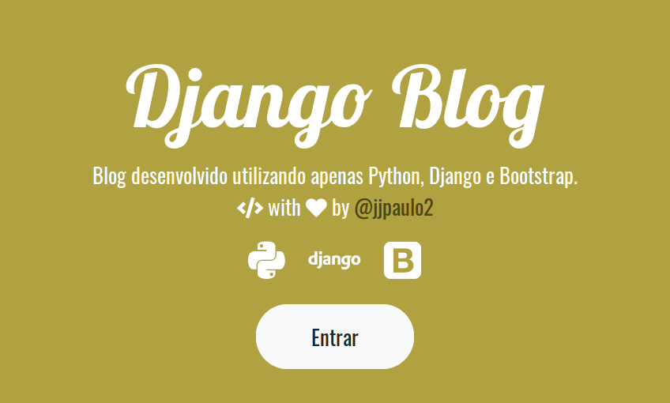
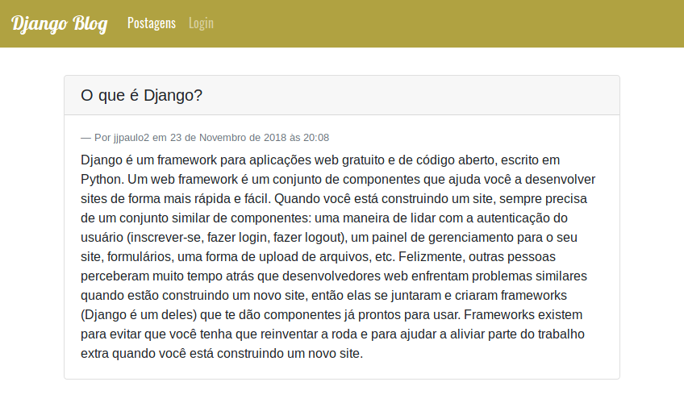

# DJANGO BLOG
Um blog desenvolvido utilizando apenas Python durante o tutorial do Django Girls Teresina 2018.

[Clique aqui](https://tutorial.djangogirls.org/pt/) para acessar o tutorial oficial do Django Girls.

### Tecnologias utilizadas
- [Python](https://www.python.org/)
- [Django (Framework)](https://www.djangoproject.com/)
- [Bootstrap (Framework)](https://getbootstrap.com/)

### Editores de texto
Qual escolher? Experimente todos e escolha aquele no qual você mais se sentir confortável em programar.
- [Atom](https://atom.io/)
- [Sublime Text](https://www.sublimetext.com/)
- [Visual Studio Code](https://code.visualstudio.com/)
---
### Processo de execução
Primeiro, você deve criar um usuário para ter acesso ao `/admin`. Para isso, acesse a pasta do projeto através do `CMD` do Windows ou `terminal` do Linux ou MacOS, execute o seguinte comando e siga os passos.
> .../> python manage.py createsuperuser

Após criar o seu usuário, é necessário gerar as tabelas da base de dados SQLite que irão alimentar a aplicação. Para tal, execute:
> .../> python manage.py makemigrations

> .../> python manage.py migrate --run-syncdb

Prontinho! O blog já está no ponto de rodar. Basta iniciar o servidor através do comando:
> .../> python manage.py runserver

E logo após acessar o endereço http://localhost:8000 em seu navegador de internet.

#### Parabéns por participar deste tutorial, você já tem tudo para dominar qualquer ferramenta de desenvolvimento. Vá em frente e não desista!
